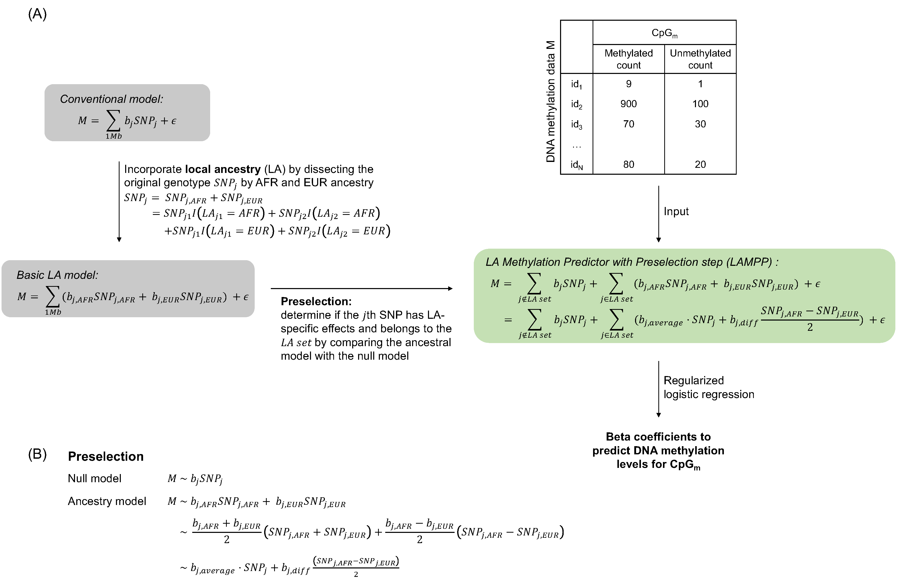

# LAMPP
Incorporate local ancestry information to predict genetically associated CpG methylation in admixed populations

## Workflow


## Tutorial
### Use pre-computed predictive models
The `ModelCoeff` folder contains the precomputed weights to predict DNA methylations. The weights were computed using an admixed African-American dataset (n=377) with matched genotype and Methylation Capture Sequencing (MC-seq) data. It could be used to predict methylations for admixed populations with both African (AFR) and European (EUR) ancestry backgrounds. Each file contains the weights to predict CpGs on each chromosome. For example, 
```
        probe       BP CHR        id_1       id_2        id_3       id_4
1  cg08730728 37252593  22 -5.48097920 -5.7615145 -5.84497641 -5.7453667
2  cg25294651 42919443  22  2.92992156  2.7553017  2.30812230  2.3923174
3  cg15283028 41601160  22 -6.07666920 -5.9796267 -6.37562358 -6.2921390
4  cg21855135 42353933  22 -2.55987152 -2.1778738 -2.75530165 -2.6189098
5  cg04371950 45602057  22 -0.07503705  0.1965098 -0.09236402 -0.5789538
6  cg03070533 35653394  22 -6.30378075 -6.4641081 -6.42553520 -6.3879443
...
```
- **Probe:** The CpG to be predicted.
- **snp:** The SNP used as predictor.
- **Chr:** The chromosome for the CpG and SNP.
- **ALT:** The effect allele of the SNP.
- **REF:** The non-effect/reference allele of the SNP.
- **Effect:** Terms indicating how to apply the effect sizes: `b_average` or `b_diff`. `b_average` indicates the effect size is to be applied on the original genotype $`SNP_j`$ (also equivalent to $`SNP_{j,AFR}+SNP_{j,EUR}`$). `b_diff` indicates the effect size is to be applied on the difference between the AFR and EUR genotype $`\frac{SNP_{j,AFR}-SNP_{j,EUR}}{2}`$. Specifically, $`SNP_{j,AFR}`$ and $`SNP_{j,EUR}`$ can be obtained by incorporating local ancestry and dissecting the original genotype into two ancestries (details in the workflow). 
- **Coeff:** The corresponding effect sizes.

### Compute your own predictive models

